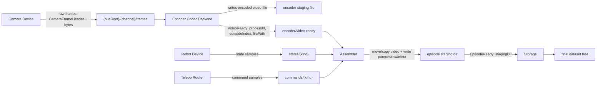
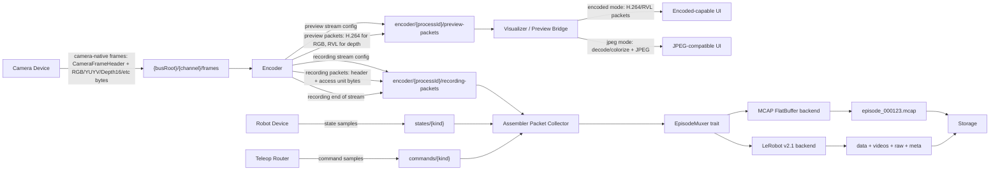
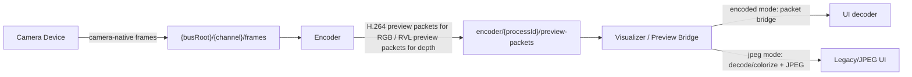

# Encoded Packet Muxing Refactor Plan

## Assumptions
- Target scope: a generic assembler-owned muxing abstraction with initial backends for MCAP using FlatBuffers and LeRobot v2.1.
- Encoder input stays camera-frame oriented: device processes publish camera-native frame payloads with `CameraFrameHeader` on the raw frame topic. "Raw" means the direct sensor/bus formats Rollio accepts, including RGB24, BGR24, Gray8, YUYV, Depth16, and camera-native MJPEG.
- Future camera-native encoded inputs are valid. For example, a camera may publish H.264 access units directly; in that case Rollio should use a passthrough encoder/session that validates, normalizes metadata/timestamps, and republishes packets without unnecessary decode/re-encode when the requested output contract is compatible.
- Encoder output splits into two packetized streams:
  - Recording packets: high-quality/lossless-as-configured elementary access units for the episode assembler. H.264/H.265 use Annex B; AV1 and RVL use their canonical packet/frame formats.
  - Preview packets: lower-quality encoded access units intended for live display. RGB/color-like channels use H.264 preview packets. Depth channels use RVL preview packets, with color visualization performed by the frontend.
- Delivery semantics: recording packet transport should never silently lose data. If strict lossless blocking is not provable with iceoryx2 pub/sub alone, the design must detect sequence gaps and discard the episode rather than producing a corrupt artifact.
- Preview should no longer require encoder-side manual downscale to RGB24. The primary preview path should display/forward encoded preview packets directly.
- JPEG preview remains supported as a compatibility/frontend mode. In JPEG mode, the visualizer receives encoded preview packets, decodes them, optionally colorizes depth, JPEG-compresses frames, and sends the existing image-style WebSocket messages.
- Because the preview payload changes from standalone JPEG images to codec streams, the visualizer and UI are in scope for this refactor. The visualizer becomes either a packet bridge / stream metadata broker or a compatibility transcoder depending on the preview output mode.
- Encoder internals must stay backend-agnostic. FFmpeg/libav is the current implementation, but the packet contract should also support future direct vendor codec SDKs such as NVIDIA, Intel, Rockchip, Jetson, or other hardware encoders.
- Supported recording codecs should be H.264, H.265, AV1, and MJPG for RGB/color-like streams, plus RVL for depth streams. MJPG should be treated as a recording codec distinct from the best-effort WebSocket JPEG preview path.
- Recording packet delivery should use iceoryx2 pub/sub with safe overflow disabled and publisher delivery set to `UnableToDeliverStrategy::Block`, plus sequence-gap detection that fails the episode on any missing packet.
- H.264/H.265 IPC payloads should use canonical Annex B elementary access units. AV1 should use canonical temporal-unit / OBU framing with sequence headers carried in stream config. Container-specific conversion such as Annex B -> AVCC/HVCC belongs in assembler muxer adapters.
- Preview packet delivery can be best-effort: use sequence numbers and keyframe flags so the preview consumer can recover at the next keyframe after packet loss.

## Status Quo Data Flow

Current camera recording boundary:
- [encoder/src/media.rs](encoder/src/media.rs) owns both encoding and muxing; `LibavSession::receive_packets` writes packets into the FFmpeg output context.
- [encoder/src/runtime.rs](encoder/src/runtime.rs) publishes only `VideoReady { process_id, episode_index, file_path }`.
- [episode-lerobot/src/runtime.rs](episode-lerobot/src/runtime.rs) stores the path and later [episode-lerobot/src/dataset.rs](episode-lerobot/src/dataset.rs) moves/copies the completed artifact into `videos/...`.

Current preview boundary:
- [encoder/src/runtime.rs](encoder/src/runtime.rs) always runs a preview tap for every received frame.
- [encoder/src/media.rs](encoder/src/media.rs) decodes/copies camera frames, manually downsizes them, converts them to RGB24, and publishes preview frames on the preview topic.
- [visualizer/src/preview_pipeline.rs](visualizer/src/preview_pipeline.rs) JPEG-compresses the RGB24 preview frames before broadcasting to the UI.
- [visualizer/src/protocol.rs](visualizer/src/protocol.rs), [ui/terminal/src/lib/protocol.ts](ui/terminal/src/lib/protocol.ts), and [ui/web/src/lib/websocket.ts](ui/web/src/lib/websocket.ts) all currently model binary camera messages as single JPEG images.

## Target Data Flow

Target camera recording boundary:
- Encoder produces encoded packets and stream metadata, but does not own the final recording container in `encoded_handoff = "iceoryx2"` mode.
- The assembler-facing contract is encoded packet metadata plus bytes, not FFmpeg objects. Codec backends may be FFmpeg/libav today or vendor-specific hardware SDKs later, as long as they emit the same stream configuration, packet timing, keyframe, and sequence metadata.
- Assembler owns muxing and final episode layout. For MCAP, it writes one monolithic MCAP file containing FlatBuffer messages. For LeRobot v2.1, it can still emit LeRobot's required video files, but those files are muxed by the assembler from packet IPC rather than moved from encoder output.
- The existing `encoded_handoff = "file"` path remains as a compatibility fallback until packet mode is proven.

Target preview boundary:
- Encoder also produces a preview-quality encoded packet stream from the same camera-native input frames.
- Preview packets are independent from recording packets: lower resolution/bitrate/GOP settings are configurable, and packet loss should degrade live display rather than fail an episode.
- The visualizer supports two output modes:
  - Encoded mode: forward H.264/RVL preview packets and stream config to the UI with minimal repackaging.
  - JPEG compatibility mode: decode preview packets, colorize depth when needed, JPEG-compress, and emit the existing image-like WebSocket protocol for clients such as the terminal UI.
- UIs that choose encoded mode should treat preview as a codec stream, not as independent images. They must receive stream configuration before decode, reset/recover at keyframes, and handle late joins by requesting or waiting for a keyframe.

## Clarified Muxing Design
- Do not make the assembler globally FFmpeg-dependent. Add an assembler-owned muxing trait and use FFmpeg/libavformat only in a `FfmpegVideoMuxer` adapter where standard video containers are required.
- LeRobot v2.1 packet mode should use the muxing abstraction to reconstruct per-camera video files under `videos/...` from packet IPC. H.264/H.265/AV1/MJPG can use `FfmpegVideoMuxer`; RVL should use a small RVL writer or a codec-specific muxer because it is not a normal libavformat video container in the current code.
- MCAP + FlatBuffers should not require FFmpeg. The MCAP backend should register FlatBuffer schemas and channels, then write robot samples, action samples, stream configs, and encoded packet payloads as MCAP messages.
- FFmpeg remains useful as the first muxer adapter and current codec backend, but neither the IPC structs nor the `EpisodeMuxer` trait should expose FFmpeg packet/context types.

## Refactor Steps

1. Define encoded packet IPC contracts.
- Extend [rollio-types/src/messages.rs](rollio-types/src/messages.rs) with an `EncodedPacketHeader` user header for `publish_subscribe::<[u8]>()`.
- Header fields should include: `process_id`, `episode_index`, packet kind (`stream-config`, `packet`, `end-of-stream`), codec, dimensions, pixel format, time base, `pts`, `dts`, `duration`, keyframe flag, sequence number, payload length, and backend-neutral bitstream metadata versioning.
- Stream configuration payloads must carry codec initialization data in a backend-neutral shape: codec id (`h264`, `h265`, `av1`, `mjpg`, `rvl`), codec profile/level when known, chroma/bit-depth/color metadata, time base, coded dimensions, and codec extradata such as H.264/H.265 SPS/PPS/VPS or AV1 sequence headers.
- Codec-specific payload expectations:
  - H.264/H.265: Annex B access units with SPS/PPS/VPS available in stream config and repeated in-band at keyframes when the backend naturally emits them.
  - AV1: temporal-unit / OBU payloads with sequence headers available in stream config.
  - MJPG: one JPEG image per packet/access unit, intended for RGB/color-like streams.
  - RVL: one RVL-compressed depth frame per packet/access unit, intended for `depth16` streams.
- Encoded camera input passthrough should use the same packet contract. A passthrough session for camera-native H.264 should generate/forward stream config, preserve capture timestamps/frame indices, and emit normalized Annex B packets when the incoming framing is compatible.
- Per-packet timing belongs in the fixed iceoryx2 user header: `pts`, `dts`, `duration`, `time_base_num`, `time_base_den`, original capture `timestamp_us`, source `frame_index`, sequence number, keyframe/config/eos flags, and payload length. Packet payloads should contain only encoded access-unit bytes or stream-config/extradata bytes.
- Stream identity should avoid large strings in every packet. Use a compact numeric `stream_id` in packet headers and send `channel_id`, `encoder_process_id`, codec metadata, and human-readable names in the stream-config payload.
- Distinguish packet purpose in the contract, either by topic or header field. Prefer separate topics so subscribers can apply different delivery semantics:
  - `encoder/{process_id}/recording-packets` for strict recording delivery.
  - `encoder/{process_id}/preview-packets` for best-effort live preview delivery.
- Extend [rollio-bus/src/lib.rs](rollio-bus/src/lib.rs) with recording and preview packet topic naming plus capacity constants distinct from state/control topics.

2. Split encoder backend, packet production, and muxing.
- In [encoder/src/media.rs](encoder/src/media.rs), introduce backend-agnostic traits such as `CodecSession` and `EncodedPacketSink`. `CodecSession` turns `OwnedFrame` inputs into `EncodedPacket` outputs; sinks decide whether packets go to an FFmpeg muxer/file, recording IPC, or preview IPC.
- Keep the current `FileArtifactSink` behavior for `encoded_handoff = "file"`.
- Add an `IpcPacketSink` used by `encoded_handoff = "iceoryx2"`; the current FFmpeg session should emit backend-neutral packet bytes and timing metadata instead of calling `packet.write_interleaved` directly.
- Add a separate `PreviewCodecSession` or a second `CodecSession` instance per camera for live preview. It should encode lower-quality preview packets from the same input frames without publishing RGB24 frames or invoking the visualizer JPEG path.
- Add a `PassthroughCodecSession` for already-encoded camera inputs such as future H.264 sensor streams. It should avoid decode/re-encode when recording and/or preview output can reuse the incoming elementary stream, and should fall back to transcode only when output codec, quality, resolution, or GOP requirements differ.
- Preview configuration should be separate from recording configuration and live under `[encoder.preview]`: preview codec policy, bitrate/quality, GOP/keyframe interval, target FPS, and any resolution/scaling policy. RGB/color-like preview codec is H.264. Depth preview codec is RVL.
- Keep FFmpeg/libav as the first `CodecSession` implementation, but avoid exposing FFmpeg packet/context types outside that adapter. Future vendor-specific implementations should plug in by emitting the same `EncodedPacket`/stream-config structs.
- Configure recording packet publishers with safe overflow disabled and `UnableToDeliverStrategy::Block`. The current iceoryx2 defaults are preview-like (`enable_safe_overflow = true`, small subscriber buffer), so packet-mode must explicitly set buffer/history/overflow/delivery options on both producer and consumer service builders.
- Configure preview packet publishers for low latency rather than durability. Safe overflow/drop-latest semantics are acceptable only if stream config, keyframe cadence, and sequence numbers let the UI recover quickly.
- Keep `max_b_frames = 0` initially so encoded order equals display order and DTS/PTS handling stays simple. Revisit B-frames only after packet-mode muxing is stable.

3. Add assembler packet collection.
- In [episode-lerobot/src/runtime.rs](episode-lerobot/src/runtime.rs), branch on `EncodedHandoffMode`.
- For file mode, keep `VideoReady` behavior unchanged.
- For packet mode, subscribe to configured encoder packet topics, maintain per-camera stream state, validate sequence continuity, and mark an episode ready only after every camera sends end-of-stream and all robot/action buffers are frozen.
- On packet gaps or malformed stream config, publish/propagate a recording failure rather than staging a partial episode.
- Treat packet delivery failure as a recording failure, not a partial-camera success. The current file-mode timeout behavior may drop missing videos from an episode; packet-mode should be stricter because one missing packet can corrupt an entire GOP or video stream.

4. Introduce a generic muxing abstraction.
- Add an assembler-local trait such as `EpisodeMuxer` with methods like `begin_episode`, `write_robot_sample`, `write_action_sample`, `write_encoded_video_packet`, and `finish_episode`.
- Move LeRobot-specific output behind a `LeRobotV21Muxer` while preserving existing row-aligned Parquet and raw dump logic in [episode-lerobot/src/lerobot.rs](episode-lerobot/src/lerobot.rs) and [episode-lerobot/src/raw.rs](episode-lerobot/src/raw.rs).
- Add an `McapFlatbufferMuxer` module for MCAP output.
- Add codec-specific muxer helpers under the abstraction:
  - `FfmpegVideoMuxer` for H.264/H.265/AV1/MJPG standard video files, including Annex B -> MP4/MKV configuration conversion where needed.
  - `RvlFrameMuxer` or equivalent for RVL depth streams.
  - MCAP writer path for FlatBuffer-wrapped encoded packets and metadata.

5. Add MCAP + FlatBuffers support.
- Add Rust dependencies for MCAP and FlatBuffers in [episode-lerobot/Cargo.toml](episode-lerobot/Cargo.toml).
- Define FlatBuffer schemas for robot samples, action samples, video stream config, encoded video packets, episode metadata, and possibly the embedded config TOML.
- MCAP topics should include one topic per camera packet stream and robot/action channel, with timestamps based on the controller's recording start anchor.

6. Update runtime config derivation.
- Extend [rollio-types/src/config.rs](rollio-types/src/config.rs) so encoder runtime configs include packet topic names when `encoded_handoff = "iceoryx2"`.
- Extend encoder runtime configs with `[encoder.preview]`-derived packet settings: preview packet topic, preview codec policy, preview quality/bitrate, preview GOP/keyframe interval, preview FPS, and any preview resolution/scaling policy.
- Extend the codec enum/config validation to include `mjpg` for RGB/color-like recording streams while keeping `rvl` constrained to depth streams. Preserve H.264, H.265, and AV1 as general video codecs.
- Extend assembler runtime configs with per-camera packet topics alongside current `encoder_process_id` metadata.
- Extend visualizer/UI runtime configs with preview packet topics, preferred preview output mode (`encoded` or `jpeg`), and decoder/transcoder metadata. Move encoder-owned preview production settings to `[encoder.preview]`. Keep visualizer-owned JPEG settings (`jpeg_quality`, JPEG worker count) only for JPEG compatibility mode.
- Update setup/control surfaces that expose preview settings:
  - [controller/src/setup.rs](controller/src/setup.rs) setup-state generation and setup commands.
  - [control-server](control-server) payloads if preview settings are surfaced through control messages.
  - [ui/terminal/src/SetupApp.tsx](ui/terminal/src/SetupApp.tsx) fields currently named around JPEG quality / preview FPS.
  - [config/config.example.toml](config/config.example.toml), [visualizer/README.md](visualizer/README.md), and websocket protocol docs.
- Keep `EncodedHandoffMode::File` as default so existing LeRobot v2.1 behavior remains stable.

7. Replace RGB preview input with encoded preview packets while preserving JPEG output mode.

- Do not route preview through the recording packet path. Preview has different quality, latency, and failure semantics.
- Remove the encoder's RGB24 preview tap once encoded preview packets are stable.
- Rework [visualizer/src/preview_pipeline.rs](visualizer/src/preview_pipeline.rs) into a compatibility transcoding path for JPEG output mode. It should decode H.264 preview packets for RGB channels and decode/colorize RVL preview packets for depth channels before JPEG compression.
- Update [visualizer/src/ipc.rs](visualizer/src/ipc.rs) to subscribe to preview packet topics instead of RGB24 preview frame topics.
- Update [visualizer/src/protocol.rs](visualizer/src/protocol.rs) so binary messages are no longer `FRAME_TYPE_JPEG`. Add explicit message kinds for preview stream config, preview packet, decoder reset/keyframe request/notification if needed, and keep robot/stream-info JSON messages separate.
- Update [visualizer/src/stream_info.rs](visualizer/src/stream_info.rs) to report encoded preview codec, packet FPS, bitrate/bytes, dropped packet counters, keyframe age, decoder/reset state, and active preview dimensions without JPEG-specific fields.
- Update [visualizer/src/main.rs](visualizer/src/main.rs) and CLI help to describe packet bridging plus optional JPEG compatibility transcoding. Keep preview worker configuration only for JPEG output mode.
- Require frequent preview keyframes or explicit decoder reset messages so the UI can recover after best-effort packet drops or after a client joins mid-stream.
- Encoded output mode should initially bridge Annex B H.264 packets with stream config metadata. If the selected frontend decoder requires a different envelope, add a visualizer-side adapter but keep the iceoryx2 packet contract Annex B.

8. Update UI preview decoding and rendering.
- Update [ui/web/src/lib/websocket.ts](ui/web/src/lib/websocket.ts) so `CameraFrame` no longer stores `objectUrl` / `jpegBytes`. It should track stream config, decode state, packet sequence, frame timestamps, dropped packets, and decoded frame handles or a renderer-owned surface.
- Add a web preview decoder/renderer module. Good implementation options:
  - Preferred low-latency option: WebCodecs `VideoDecoder` fed from WebSocket preview stream config and encoded chunks. This keeps latency low and avoids media container muxing, but requires browser capability checks plus H.264 packet/config parsing.
  - Compatibility browser option: visualizer packages preview into fragmented MP4 for Media Source Extensions. This is more broadly familiar for browser video pipelines but adds muxing latency and complexity.
  - Compatibility fallback: request JPEG output mode from the visualizer and render image frames as today.
- Update [ui/web/src/App.tsx](ui/web/src/App.tsx) and preview tile components to render decoded video frames/canvas/video surfaces instead of `` object URLs.
- Update [ui/terminal/src/lib/protocol.ts](ui/terminal/src/lib/protocol.ts) binary parser and types so terminal/setup flows parse preview stream config and packet messages instead of JPEG frames.
- Terminal UI should continue showing live camera preview by using visualizer JPEG output mode initially. Native terminal H.264/RVL decoding can be a later optimization, not a prerequisite for this refactor.
- Update UI metrics and debug labels from JPEG/image terminology (`jpeg_bytes`, object URL counts, active image size) to encoded-preview terminology (`preview_packet_bytes`, decoder queue depth, decoded frames, keyframe age).
- Update UI tests to cover stream config before packets, packet sequence gaps, late join before keyframe, decoder reset, and unsupported decoder environments.

9. Storage integration.
- Keep [storage-local/src/runtime.rs](storage-local/src/runtime.rs) mostly unchanged: it should still consume `EpisodeReady { staging_dir }`.
- For MCAP, the staging dir can contain a complete `.mcap` file plus metadata; storage just moves/merges it.
- For LeRobot v2.1, storage continues merging `data/`, `videos/`, `raw/`, and `meta/`.

10. Testing and migration.
- Unit-test packet header round-trips and service naming.
- Encoder tests: file mode still emits `VideoReady`; packet mode emits backend-neutral recording stream config, ordered recording packets, recording end-of-stream, and best-effort preview stream config/packets. Add adapter-level tests that assert the FFmpeg implementation does not leak FFmpeg-specific types into shared IPC structs.
- Codec matrix tests: H.264, H.265, AV1, and MJPG on RGB/color-like streams; RVL on `depth16`; validation rejects RVL for RGB and MJPG for depth unless a future backend deliberately supports that combination.
- Assembler tests: packet gaps fail the episode; complete streams stage successfully.
- Preview tests: visualizer/UI can initialize from stream config, decode a keyframe plus delta packets, recover after dropped preview packets at the next keyframe, and handle late-joining clients.
- Integration tests: pseudo camera/robot recording in file mode and packet mode for LeRobot v2.1; MCAP output opens with an MCAP reader and contains expected FlatBuffer topics.
- UI/browser tests: web preview decoder handles config+packets, missing keyframe, reconnect, unsupported WebCodecs, and stream reset. Terminal UI tests cover protocol parsing and whichever render policy is selected.
- Crash cleanup tests: packet mode should not leave encoder video files because encoder no longer creates them; assembler staging cleanup remains responsible for partial episode artifacts.
- Migration path: keep JPEG preview output as a supported visualizer mode, not just a temporary fallback, until every required frontend has a native encoded-packet decoder. Terminal UI should use this path initially.

## Risks To Resolve Early
- iceoryx2 pub/sub can be configured to block instead of dropping when receiver buffers are full, but packet mode must explicitly disable safe overflow and set `UnableToDeliverStrategy::Block`. Sequence numbers remain mandatory because they catch configuration mistakes, disconnects, or future non-blocking transports.
- FFmpeg muxing currently happens inside the encoder. Packet mode needs careful extraction of codec extradata and time-base metadata so assembler-side muxers can write valid H.264/H.265/AV1 streams. This extraction should be modeled as generic codec stream metadata so vendor SDK backends are not forced through FFmpeg.
- Annex B is the chosen IPC normalization for H.264/H.265, but MP4 needs AVCC/HVCC-style codec configuration and length-prefixed samples. The assembler's FFmpeg muxer adapter must own that conversion or use libavformat APIs correctly.
- Vendor-specific hardware encoders may expose different packet framing, extradata timing, alignment requirements, memory ownership, and hardware buffer lifetimes. The first packet-mode interface should copy encoded access-unit bytes into iceoryx2-owned memory and leave zero-copy hardware-buffer sharing as a later optimization.
- MCAP with FlatBuffers can represent encoded packet payloads, but wrapping large video access units inside FlatBuffer vectors adds a copy at final write time. Accept this initially unless profiling shows it dominates.
- Running two encoders per camera stream can be expensive, especially on CPU-only hosts. The scheduler/config must allow preview FPS/quality/keyframe interval to be tuned low enough that preview does not starve recording.
- Browser/UI H.264 packet display has codec/container expectations. Annex B over WebSocket may require a UI-side parser, WebCodecs integration, or conversion to AVC decoder configuration records; the exact UI transport must be designed for encoded output mode.
- If "no encoder-side manual downsize" is strict, preview bandwidth may be high unless the camera provides a lower-resolution stream or the codec backend can scale internally. Decide whether codec filter scaling is allowed, or whether preview resolution must come from a separate camera mode/channel.
- WebCodecs support is browser/runtime-dependent. The web UI can likely target WebCodecs, while the terminal UI should use JPEG output mode initially because Node/Ink does not naturally display raw H.264 packets.
- H.264 packet streams are stateful. Unlike JPEG images, reconnects and late subscribers need stream config plus a keyframe before any frame can be displayed.
- Frontend depth visualization from RVL packets is a good ownership boundary if the UI needs interactive color maps/ranges, but it means every encoded-mode frontend must implement RVL decode and depth colorization. JPEG compatibility mode should keep visualizer-side RVL decode/colorize so simple clients still work.

## Resolved Decisions
- Camera-native MJPEG is a valid encoder input.
- Future camera-native H.264 packet streams are valid inputs and should use a passthrough encoder/session when compatible with the requested output.
- RGB/color-like preview uses H.264 packets.
- Depth preview uses RVL packets in encoded mode; frontend clients are responsible for RVL decode and color visualization.
- Preview production settings live under `[encoder.preview]`.
- Terminal UI must keep live preview. It should use the visualizer's JPEG output mode initially.
- Visualizer supports both output modes:
  - `jpeg`: decode H.264/RVL preview packets, colorize depth if needed, JPEG-compress, and send image frames.
  - `encoded`: bridge preview packet stream config and Annex B/RVL packets to external clients over WebSocket or another outer transport.

## Remaining Design Choices
- Pick the first web encoded-preview transport:
  - WebCodecs over WebSocket for lowest latency and clean packet semantics.
  - MSE/fMP4 for a more media-element-like browser path with extra muxing.
  - JPEG mode as fallback for unsupported browsers.
- Define exactly how the UI requests preview output mode from the visualizer: runtime config, WebSocket command, URL path, or capability negotiation.
- Define whether preview resolution reduction is allowed inside the encoder through codec/filter scaling, or must come from camera mode selection/display scaling.
