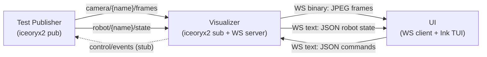
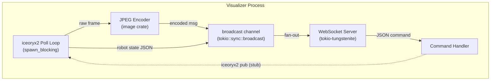
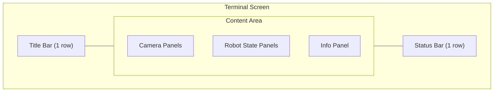

# Sprint 1 -- Visualizer + UI Skeleton

## Goal

A working **iceoryx2 -> WebSocket -> TUI** pipeline. A human can run three processes in three terminals and see synthetic camera frames (color bars) and oscillating robot joint bars rendered live in the terminal.

## Architecture



## iceoryx2 Topic Naming

Convention: `{device_type}/{device_name}/{stream}`. No prefix. Examples:
- `camera/camera_top/frames` -- `publish_subscribe::<[u8]>()` with `user_header::<CameraFrameHeader>()`
- `robot/leader_arm/state` -- `publish_subscribe::<RobotState>()`
- `control/events` -- `publish_subscribe::<ControlEvent>()`

## WebSocket Protocol

The binary protocol uses a **type-tag byte** as the first byte of every binary message. Sprint 1 implements JPEG (type `0x01`). The protocol is designed to support additional frame encodings (H.264, H.265, AV1) in future sprints by reserving type tags -- no breaking changes needed.

**Binary messages** (Visualizer -> UI) -- camera frames:
```
Byte 0:      frame encoding type
               0x01 = JPEG (Sprint 1)
               0x02 = H.264 NAL unit (reserved, future)
               0x03 = H.265 NAL unit (reserved, future)
               0x04 = AV1 OBU (reserved, future)
               0x05 = raw RGB24 (reserved, future)
Bytes 1-2:   camera name length (u16 LE)
Bytes 3..N:  camera name (UTF-8)
Bytes N+1..4: original width (u32 LE)
Bytes N+5..8: original height (u32 LE)
Remaining:   encoded frame data (JPEG payload for type 0x01)
```

**Text/JSON messages** (both directions):
```
Visualizer -> UI:
  {"type":"robot_state","name":"leader_arm","timestamp_ns":...,"num_joints":6,"positions":[...],"velocities":[...],"efforts":[...]}

UI -> Visualizer (stub, Sprint 1):
  {"type":"command","action":"episode_start"}
```

---

## 1. Test Publisher

**File:** [test/test-publisher/src/main.rs](test/test-publisher/src/main.rs)
**New file:** `test/test-publisher/src/frames.rs` (color bar generator)

**Dependencies to add** to [test/test-publisher/Cargo.toml](test/test-publisher/Cargo.toml):
- `clap` (CLI args: `--cameras`, `--robots`, `--fps`, `--width`, `--height`)

**Implementation:**

- Create one iceoryx2 `Node` via `NodeBuilder::new().create::<ipc::Service>()`
- For each camera (default 2, names `camera_0`, `camera_1`):
  - Open service `camera/{name}/frames` as `publish_subscribe::<[u8]>().user_header::<CameraFrameHeader>()`
  - Publisher with `.initial_max_slice_len(width * height * 3)` and `.allocation_strategy(AllocationStrategy::PowerOfTwo)`
- For each robot (default 1, name `robot_0`, 6 DoF):
  - Open service `robot/{name}/state` as `publish_subscribe::<RobotState>()`
- Main loop at configured FPS (default 30):
  - Generate color bar frame: 8 vertical stripes (white, yellow, cyan, green, magenta, red, blue, black) with frame counter text burned in via simple pixel font
  - Fill `CameraFrameHeader` (timestamp from `std::time::Instant`, width, height, `PixelFormat::Rgb24`, incrementing frame_index)
  - `publisher.loan_slice_uninit(payload_len)` -> write frame bytes -> `send()`
  - Generate `RobotState` with sine-wave positions: `pos[i] = sin(t + i * 0.5)`, zero velocities/efforts
  - Publish robot state

Refer to the iceoryx2 dynamic data publisher example pattern at `third_party/iceoryx2/examples/rust/publish_subscribe_dynamic_data/publisher.rs` and the user-header example at `third_party/iceoryx2/examples/rust/publish_subscribe_with_user_header/publisher.rs`.

---

## 2. Visualizer

**File:** [visualizer/src/main.rs](visualizer/src/main.rs)
**New files:**
- `visualizer/src/ipc.rs` -- iceoryx2 subscriber management
- `visualizer/src/websocket.rs` -- WebSocket server, client broadcast
- `visualizer/src/jpeg.rs` -- RGB24 -> JPEG compression + optional downsampling
- `visualizer/src/protocol.rs` -- binary/JSON message encoding

**Dependencies to add** to [visualizer/Cargo.toml](visualizer/Cargo.toml):
- `tokio` (features: `full`) -- async runtime
- `tokio-tungstenite` -- WebSocket server
- `futures-util` -- stream utilities
- `image` -- JPEG encoding
- `serde` + `serde_json` -- JSON protocol
- `clap` -- CLI args (`--port`, `--cameras`, `--robots`, `--max-preview-width`)
- `log` + `env_logger` -- logging

**Architecture:**



**Implementation:**

- `main.rs`: Parse CLI args, start tokio runtime, spawn iceoryx2 poller, run WebSocket server
- `ipc.rs`:
  - `IpcPoller` struct: creates iceoryx2 node, opens subscriber services for `camera/{name}/frames` and `robot/{name}/state` topics
  - `poll()` method: non-blocking receive from all subscribers, returns `Vec<IpcMessage>` enum (CameraFrame or RobotState)
  - Runs in `tokio::task::spawn_blocking` with a tight poll loop (`node.wait(Duration::from_millis(1))`)
- `jpeg.rs`:
  - `compress_to_jpeg(rgb_data: &[u8], width: u32, height: u32, max_width: u32) -> Vec<u8>`
  - If `width > max_width`, downsample using `image::imageops::resize` with `FilterType::Triangle`
  - Encode to JPEG quality 75 using `image::codecs::jpeg::JpegEncoder`
- `protocol.rs`:
  - `encode_camera_frame(name: &str, width: u32, height: u32, jpeg: &[u8]) -> Vec<u8>` (binary)
  - `encode_robot_state(name: &str, state: &RobotState) -> String` (JSON)
  - `decode_command(text: &str) -> Option<Command>` (JSON)
- `websocket.rs`:
  - `run_server(addr, broadcast_rx)`: accept WebSocket connections, spawn a task per client
  - Each client task: subscribe to `broadcast::Receiver`, forward messages to WebSocket; read incoming WebSocket messages and parse as commands
  - Graceful handling: client disconnect does not crash server, server starts before any iceoryx2 data arrives

**Robustness:** The Visualizer starts the WebSocket server immediately. If no iceoryx2 publishers exist, it simply has nothing to broadcast -- clients connect but receive no data. When publishers appear, data starts flowing.

---

## 3. UI

**Files to modify:** [ui/terminal/src/index.tsx](ui/terminal/src/index.tsx), [ui/terminal/package.json](ui/terminal/package.json)
**New files:**
- `ui/terminal/src/App.tsx` -- main layout component (title bar, content, status bar)
- `ui/terminal/src/components/TitleBar.tsx` -- app name, mode, wizard step indicator
- `ui/terminal/src/components/StatusBar.tsx` -- mode, state, episode count, health indicator
- `ui/terminal/src/components/InfoPanel.tsx` -- device parameters and config summary
- `ui/terminal/src/components/StreamPanel.tsx` -- JPEG -> ANSI half-block camera preview
- `ui/terminal/src/components/RobotStatePanel.tsx` -- bar/gauge joint display
- `ui/terminal/src/lib/websocket.ts` -- WebSocket client with auto-reconnect
- `ui/terminal/src/lib/protocol.ts` -- message type definitions, binary parser
- `ui/terminal/src/lib/ansi-renderer.ts` -- JPEG decode + pixel -> ANSI 256-color half-block
- `ui/terminal/src/lib/color-palette.ts` -- RGB -> nearest ANSI 256-color mapping

**Dependencies to add** to [ui/terminal/package.json](ui/terminal/package.json):
- `jpeg-js` -- pure JS JPEG decoder (no native deps)
- `ink-use-stdout-dimensions` (or custom hook) -- responsive terminal sizing
- `@types/jpeg-js` -- types

**Implementation:**

- `lib/color-palette.ts`:
  - Build the standard 256-color ANSI palette (16 system + 216 color cube + 24 grayscale)
  - `nearestAnsi256(r, g, b) -> number`: find closest palette entry by Euclidean distance in RGB space
  - Cache the palette as a flat lookup array for speed

- `lib/ansi-renderer.ts`:
  - `renderToAnsi(rgbPixels: Uint8Array, imgWidth: number, imgHeight: number, termCols: number, termRows: number) -> string`
  - Resize image to fit terminal: each cell is 1 char wide x 2 pixels tall (half-block)
  - For each pair of vertical pixels: top = background color (ESC[48;5;Nm), bottom = foreground color (ESC[38;5;Nm), char = `\u2584`
  - Return the full ANSI string (rendered efficiently, one string concat)

- `lib/protocol.ts`:
  - TypeScript types for `CameraFrameMessage`, `RobotStateMessage`, `CommandMessage`
  - `parseBinaryMessage(data: Buffer) -> CameraFrameMessage | null` -- decode type tag + header + JPEG payload
  - `parseJsonMessage(text: string) -> RobotStateMessage | null`

- `lib/websocket.ts`:
  - `useWebSocket(url: string)` React hook
  - Manages WebSocket lifecycle, auto-reconnect with exponential backoff
  - Returns `{ frames: Map<string, CameraFrame>, robotStates: Map<string, RobotState>, connected: boolean, send: (msg) => void }`
  - Updates state on each incoming message

- `components/StreamPanel.tsx`:
  - Props: `jpegData: Buffer | null`, `width: number`, `height: number`, `name: string`, `termWidth: number`, `termHeight: number`
  - Decode JPEG via `jpeg-js`, render via `ansi-renderer`, output as Ink `<Text>` with raw ANSI
  - When `jpegData` is null: render "No signal" placeholder with dashed border
  - Memoize rendering to avoid redundant decodes

- `components/RobotStatePanel.tsx`:
  - Props: `name: string`, `numJoints: number`, `positions: number[]`, `termWidth: number`
  - For each joint: render a horizontal bar `[████████░░░░░░] 0.52` with value label
  - Normalize joint values to [-pi, pi] range for bar fill
  - When no data: render "Waiting for data..." placeholder

- `components/TitleBar.tsx`:
  - Props: `mode: "collect" | "setup" | "replay"`, `wizardStep?: { current: number, total: number, name: string }`
  - Renders 1 row: left-aligned `rollio`, right-aligned mode label, center wizard step (if present)
  - Uses Ink `<Box>` with `justifyContent: "space-between"`

- `components/StatusBar.tsx`:
  - Props: `mode: string`, `state: string`, `episodeCount: number`, `connected: boolean`, `health: "normal" | "degraded" | "failure"`
  - Renders 1 row: left side shows mode/state/episodes/connection, right side shows `[Normal]`/`[Degraded]`/`[Failure]`
  - Health color: green for Normal, yellow for Degraded, red for Failure

- `components/InfoPanel.tsx`:
  - Props: `devices: DeviceInfo[]`, `config: ConfigInfo`, `orientation: "vertical" | "horizontal"`, `termWidth: number`
  - Vertical orientation (wide terminals): renders as a right-side column listing each device and config section
  - Horizontal orientation (standard terminals): renders as a compact 2-3 row strip with devices and config inline

- `App.tsx`:
  - Use `useWebSocket("ws://localhost:9090")` hook
  - Use `useStdoutDimensions()` for responsive sizing
  - Top-level layout: `<TitleBar>`, content area, `<StatusBar>`
  - Content area: if `termCols >= 120`, info panel on right (vertical); else info panel at bottom (horizontal)
  - Derive health status: Normal if connected and all devices have recent data; Degraded if disconnected or stale data; Failure if never connected
  - Divide content width evenly among camera panels, stack robot panels below

- `index.tsx`:
  - Import and render `<App />`
  - Use Ink's `render()` with `patchConsole: false` for clean TUI

---

## UI Layout Design

The layout has five regions: **title bar** (top), **camera panels**, **robot state panels**, **info panel**, and **status bar** (bottom). The title bar and status bar are fixed at 1 row each. The remaining space is divided among the three content regions.

### Screen regions



### Wide terminal (>= 120 cols, 60 rows) -- 2 cameras, 1 robot

Info panel sits on the right side of the content area:

```
┌─ rollio ─────────────────────────────────────────────────── Collect Mode ──┐
├───────────────────────────────────────────────────────┬────── Info ────────┤
│ ┌── camera_0 ──────────────┐┌── camera_1 ───────────┐│ Devices            │
│ │                           ││                        ││  camera_0  640x480 │
│ │  ▄▄▄▄▄▄▄▄▄▄▄▄▄▄▄▄▄▄▄▄▄  ││  ▄▄▄▄▄▄▄▄▄▄▄▄▄▄▄▄▄▄  ││    30fps rgb24     │
│ │  ▄▄▄▄▄▄▄▄▄▄▄▄▄▄▄▄▄▄▄▄▄  ││  ▄▄▄▄▄▄▄▄▄▄▄▄▄▄▄▄▄▄  ││  camera_1  640x480 │
│ │  ▄▄▄▄▄▄▄▄▄▄▄▄▄▄▄▄▄▄▄▄▄  ││  ▄▄▄▄▄▄▄▄▄▄▄▄▄▄▄▄▄▄  ││    30fps rgb24     │
│ │  ▄▄▄▄▄▄▄▄▄▄▄▄▄▄▄▄▄▄▄▄▄  ││  ▄▄▄▄▄▄▄▄▄▄▄▄▄▄▄▄▄▄  ││  robot_0  6 DoF    │
│ │  ▄▄▄▄▄▄▄▄▄▄▄▄▄▄▄▄▄▄▄▄▄  ││  ▄▄▄▄▄▄▄▄▄▄▄▄▄▄▄▄▄▄  ││    free-drive      │
│ │  (ANSI half-block)  30fps ││  (ANSI half-block) 30fps││                    │
│ └───────────────────────────┘└────────────────────────┘│ Config             │
│ ┌── robot_0 (6 DoF) ─────────────────────────────────┐│  fps: 30           │
│ │ J0 █████████░░░░  0.84   J3 ███████░░░░░  0.52    ││  codec: libx264    │
│ │ J1 ██████████░░░  0.31   J4 █████████░░░  0.12    ││  format: lerobot   │
│ │ J2 █████░░░░░░░░ -0.67   J5 ████████████  0.99    ││  storage: local    │
│ └─────────────────────────────────────────────────────┘│  output: ./output  │
├───────────────────────────────────────────────────────┴────────────────────┤
│ Collect | Idle | Episodes: 0 | WS: Connected                     [Normal] │
└────────────────────────────────────────────────────────────────────────────┘
```

### Standard terminal (80x24) -- 2 cameras, 1 robot

Info panel moves below the robot panels as a compact horizontal strip:

```
┌─ rollio ──────────────────────────────── Collect ─┐
│┌─ camera_0 ──────────┐┌─ camera_1 ──────────────┐│
││ ▄▄▄▄▄▄▄▄▄▄▄▄▄▄▄▄▄▄ ││ ▄▄▄▄▄▄▄▄▄▄▄▄▄▄▄▄▄▄▄▄▄▄ ││
││ ▄▄▄▄▄▄▄▄▄▄▄▄▄▄▄▄▄▄ ││ ▄▄▄▄▄▄▄▄▄▄▄▄▄▄▄▄▄▄▄▄▄▄ ││
││ ▄▄▄▄▄▄▄▄▄▄▄▄▄▄▄▄▄▄ ││ ▄▄▄▄▄▄▄▄▄▄▄▄▄▄▄▄▄▄▄▄▄▄ ││
││ ▄▄▄▄▄▄▄▄▄▄▄▄▄▄▄▄▄▄ ││ ▄▄▄▄▄▄▄▄▄▄▄▄▄▄▄▄▄▄▄▄▄▄ ││
││               30fps  ││                    30fps ││
│└─────────────────────┘└──────────────────────────┘│
│┌─ robot_0 (6 DoF) ──────────────────────────────┐│
││ J0 ████████░░░ 0.84  J3 ██████░░░░  0.52       ││
││ J1 ██████████░ 0.31  J4 ████████░░  0.12       ││
││ J2 █████░░░░░ -0.67  J5 ██████████  0.99       ││
│└─────────────────────────────────────────────────┘│
│┌─ info ──────────────────────────────────────────┐│
││ cam_0: 640x480 30fps | cam_1: 640x480 30fps     ││
││ robot_0: 6 DoF free-drive | codec: libx264      ││
│└─────────────────────────────────────────────────┘│
├───────────────────────────────────────────────────┤
│ Collect | Idle | Ep: 0 | Connected       [Normal] │
└───────────────────────────────────────────────────┘
```

### Setup wizard mode -- title bar shows step

```
┌─ rollio ──── Setup: Step 3/6 Device Parameters ──┐
│┌─ camera_0 ──────────┐┌─ camera_1 ──────────────┐│
│ ...                                               │
│┌─ info ──────────────────────────────────────────┐│
││ camera_0:                                        ││
││   resolution: [640x480]  fps: [30]  fmt: rgb24  ││
││ camera_1:                                        ││
││   resolution: [640x480]  fps: [30]  fmt: rgb24  ││
│└─────────────────────────────────────────────────┘│
├───────────────────────────────────────────────────┤
│ Setup | Step 3/6 | 4 devices selected    [Normal] │
└───────────────────────────────────────────────────┘
```

### Placeholder states (no data)

```
┌─ rollio ──────────────────────────────── Collect ─┐
│┌─ camera_0 ──────────┐┌─ camera_1 ──────────────┐│
││                      ││                          ││
││   ╌ No signal ╌     ││    ╌ No signal ╌         ││
││                      ││                          ││
│└─────────────────────┘└──────────────────────────┘│
│┌─ robot_0 ───────────────────────────────────────┐│
││              Waiting for data...                 ││
│└─────────────────────────────────────────────────┘│
│┌─ info ──────────────────────────────────────────┐│
││              No devices connected                ││
│└─────────────────────────────────────────────────┘│
├───────────────────────────────────────────────────┤
│ Collect | Idle | Ep: 0 | WS: Disconnected  [Degraded] │
└───────────────────────────────────────────────────┘
```

### Title bar

- 1 fixed row at the top of the terminal.
- Left: application name `rollio`.
- Right: current mode (`Collect`, `Setup`, `Replay`).
- In setup wizard mode, the center shows the current step: `Setup: Step N/M <Step Name>`.
- Step names: `1 Discovery`, `2 Selection`, `3 Parameters`, `4 Pairing`, `5 Storage`, `6 Preview`.

### Status bar

- 1 fixed row at the bottom of the terminal.
- Left side: `Mode | State | Episodes: N | WS: Connected/Disconnected`.
- Right side: health indicator in brackets -- `[Normal]`, `[Degraded]`, or `[Failure]`.
  - **Normal**: all systems operational, all devices publishing, no warnings.
  - **Degraded**: one or more warnings active (e.g., low FPS, backpressure), or a non-critical device disconnected. Data collection can continue.
  - **Failure**: critical error (e.g., all cameras lost, WebSocket disconnected). Data collection cannot proceed.
- Sprint 1 implements Normal and Degraded (based on WebSocket connection state). Full warning integration comes in Sprint 7.

### Info panel

- Shows device parameters, config values, and other textual information.
- In **wide terminals** (>= 120 cols): right-side panel, fixed ~25 columns wide.
- In **standard terminals** (< 120 cols): bottom strip, 2-3 rows, between robot panels and status bar.
- Content sections:
  - **Devices**: list each device with key parameters (resolution, FPS, DoF, mode).
  - **Config**: episode format, codec, storage backend, output path.
  - In setup wizard: editable parameter fields replace the static display.

### Layout allocation rules

- **Title bar**: 1 row, always visible.
- **Status bar**: 1 row, always visible.
- **Content area**: `termRows - 2` rows.
- **Wide terminal** (>= 120 cols): info panel takes rightmost 25 columns. Remaining width is split among camera panels (top ~55%) and robot panels (bottom ~45%).
- **Standard terminal** (< 120 cols): info panel takes bottom 3 rows of content area. Camera panels split width evenly (top ~55%). Robot panels fill the middle.
- Camera preview effective resolution: `(panelWidth - 4)` columns wide, `(camRows - 3) * 2` pixels tall (half-blocks, minus border/label).
- Robot state panels: joint bars arranged in 2 columns when width allows (> 60 cols), single column otherwise.
- If 3+ cameras and terminal is narrow (< 40 cols per camera), cameras wrap to 2 rows.
- All panels use box-drawing characters for borders and include a header label.

---

## 4. Tests

Tests defined in the [implementation plan](implementation-plan.md) Sprint 1 section:

**Visualizer tests** (`visualizer/tests/`):
- WebSocket protocol: connect with no publishers (no crash), receive JPEG from published CameraFrame, receive JSON from published RobotState, 100-frame latency test
- JPEG compression: 1920x1080 input -> smaller JPEG, decode back matches (PSNR > 30dB)
- Control forwarding: send JSON command via WebSocket -> verify iceoryx2 ControlEvent

**UI tests** (`ui/terminal/src/__tests__/`):
- StreamPanel: red/green/blue stripe JPEG -> verify ANSI output has correct color codes; 1x1 JPEG edge case
- RobotStatePanel: min/mid/max values -> verify 3 bars; empty array -> placeholder
- Layout: 80x24 and 200x60 -> no crash

**Smoke test** (manual, multi-terminal):
- Start test publisher, visualizer, UI -> verify rendering within 2s, run 10s stable, kill publisher -> placeholders, restart -> resumes

---

## 5. Human Validation Steps

Checkpoints the developer should run manually at key milestones during implementation. Each step has a pass/fail criterion.

### After Test Publisher is complete

1. **Build and run**: `cargo run -p rollio-test-publisher -- --cameras 2 --robots 1 --fps 30`
   - Pass: process starts without error, prints periodic status (frame count, rate).
   - Fail: crash, iceoryx2 service creation error, or no output.

2. **iceoryx2 service visible**: while the test publisher is running, check that iceoryx2 services are registered (services should be discoverable by the Visualizer in the next step).

### After Visualizer is complete (before UI)

3. **Visualizer starts with no publishers**: `cargo run -p rollio-visualizer -- --port 9090 --cameras camera_0,camera_1 --robots robot_0`
   - Pass: WebSocket server starts, logs "listening on 0.0.0.0:9090". No crash.
   - Fail: crash or bind error.

4. **WebSocket delivers data**: start test publisher in terminal 1, start visualizer in terminal 2. Connect with a quick CLI check: `websocat ws://localhost:9090` (or a small test script).
   - Pass: binary messages (JPEG frames) and JSON messages (robot state) stream to the WebSocket client. JPEG data starts with `0x01` type tag followed by valid JPEG bytes (`FF D8` magic).
   - Fail: no messages, malformed data, or connection refused.

5. **Publisher disappears gracefully**: kill the test publisher (Ctrl+C). Verify the Visualizer does not crash and keeps the WebSocket server alive. Restart the test publisher -- data resumes.
   - Pass: no crash, data resumes within 2 seconds.
   - Fail: Visualizer crashes or hangs.

### After UI is complete

6. **UI renders with live data** (the Sprint 1 end-to-end checkpoint):
   - Terminal 1: `cargo run -p rollio-test-publisher -- --cameras 2 --robots 1 --fps 30`
   - Terminal 2: `cargo run -p rollio-visualizer -- --port 9090 --cameras camera_0,camera_1 --robots robot_0`
   - Terminal 3: `cd ui/terminal && npm start`
   - Pass: within 2 seconds, the TUI shows:
     - Title bar with `rollio` and `Collect` mode.
     - Two side-by-side camera panels with ANSI half-block color bars updating at ~30fps.
     - One robot state panel with 6 joint bars oscillating (sine wave).
     - Info panel showing device parameters.
     - Status bar showing `Connected` and `[Normal]`.
   - Fail: blank screen, crash, frozen display, or garbled output.

7. **Terminal resize**: while the UI is running, resize the terminal window (or change columns/rows).
   - Pass: layout reflows within 1 second. Camera panels and bars adjust to new dimensions. No crash or visual corruption.
   - Fail: crash, frozen layout, or overlapping panels.

8. **Placeholder states**: kill the test publisher. Within 1 second, verify:
   - Camera panels show "No signal" placeholder.
   - Robot panel shows "Waiting for data..." placeholder.
   - Status bar changes to `[Degraded]`.
   - Pass: all three conditions met.
   - Fail: UI frozen on last frame, or crash.

9. **Data recovery**: restart the test publisher.
   - Pass: live data resumes within 2 seconds. Status bar returns to `[Normal]`.
   - Fail: UI stays in placeholder state or requires restart.

10. **Stability soak**: let all three processes run for 60 seconds.
    - Pass: no crash, no visible memory growth (RSS stays within 2x initial), no frame accumulation lag (last frame received within 200ms of last published).
    - Fail: crash, OOM, or unbounded latency growth.

---

## 6. Build Integration

Update [Makefile](Makefile) to ensure `cargo build --workspace` still works (no changes needed since all crates are workspace members).

Update `ui/terminal/package.json` with new deps -- `npm install` in the `ui-install` target handles this.

---

## Key Files Summary

| Deliverable | New/Modified Files |
|---|---|
| Test Publisher | `test/test-publisher/Cargo.toml` (add clap), `test/test-publisher/src/main.rs` (rewrite), `test/test-publisher/src/frames.rs` (new) |
| Visualizer | `visualizer/Cargo.toml` (add deps), `visualizer/src/main.rs` (rewrite), `visualizer/src/{ipc,websocket,jpeg,protocol}.rs` (new) |
| UI | `ui/terminal/package.json` (add deps), `ui/terminal/src/index.tsx` (update), `ui/terminal/src/App.tsx` (new), `ui/terminal/src/components/{TitleBar,StatusBar,InfoPanel,StreamPanel,RobotStatePanel}.tsx` (new), `ui/terminal/src/lib/{websocket,protocol,ansi-renderer,color-palette}.ts` (new) |
