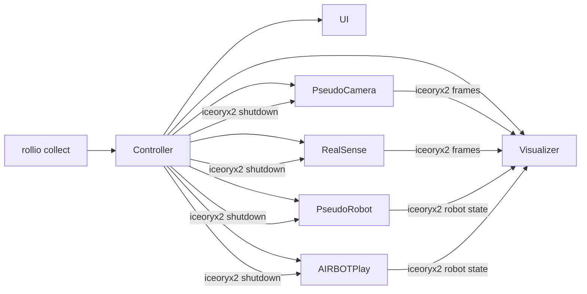

# Sprint 2 -- Driver-Centric Runtime and Device Integration

## Outcome
- Deliver the Sprint 2 target from [implementation-plan.md](implementation-plan.md), with the emphasis on drivers: camera and robot processes must maintain usable runtime status, interact efficiently with `iceoryx2`, and feed the existing preview path.
- Keep Sprint 2 aligned with [components.md](components.md): orchestration and device drivers land here, while teleop episode lifecycle stays in Sprint 3.
- Treat the Sprint 1 Visualizer/UI stack as the required status-visualization surface for Sprint 2 smoke tests rather than as a side integration detail.

## Existing Leverage
- Reuse config parsing and validation already present in [`rollio-types/src/config.rs`](../rollio-types/src/config.rs); this is the natural base for Controller-side config loading.
- Reuse shared IPC types already defined in [`rollio-types/src/messages.rs`](../rollio-types/src/messages.rs), especially `CameraFrameHeader`, `RobotState`, `RobotCommand`, and `ControlEvent::Shutdown`.
- Treat [`visualizer/src/main.rs`](../visualizer/src/main.rs) and the current UI entrypoints in [`ui/package.json`](../ui/package.json) and [`ui/src/index.tsx`](../ui/src/index.tsx) as Sprint 1 assets to integrate under Controller ownership instead of rewriting.
- Replace the current stubs at [`controller/src/main.rs`](../controller/src/main.rs), [`pseudo-robot/src/main.rs`](../pseudo-robot/src/main.rs), and [`cpp/pseudo-camera/src/main.cpp`](../cpp/pseudo-camera/src/main.cpp).
- Use the existing config example at [`config/config.example.toml`](../config/config.example.toml) as the seed for a richer device-focused config instead of inventing a separate Sprint 2 format.
- Use [`external/airbot-driver-1/README.md`](../external/airbot-driver-1/README.md), [`external/airbot-driver-1/CMakeLists.txt`](../external/airbot-driver-1/CMakeLists.txt), [`external/airbot-driver-1/pyproject.toml`](../external/airbot-driver-1/pyproject.toml), and [`external/airbot-driver-1/example/ros2/src/airbot_hardware_ros2/README.md`](../external/airbot-driver-1/example/ros2/src/airbot_hardware_ros2/README.md) as the AIRBOT driver baseline: it already provides a native C++ hardware library, optional Python bindings, realtime-oriented comm/executor helpers, host-side CAN and udev setup, and concrete product examples for position control, MIT control, and upstream free-drive.
- Use [`external/kdl_demos/gravity_comp.py`](../external/kdl_demos/gravity_comp.py), [`external/kdl_demos/src/airbot_ng/kdl/pinocchio.py`](../external/kdl_demos/src/airbot_ng/kdl/pinocchio.py), and [`external/kdl_demos/external/play_e2/urdf/play_e2.urdf`](../external/kdl_demos/external/play_e2/urdf/play_e2.urdf) as the free-drive reference path for AIRBOT Play: Sprint 2 free-drive should mean gravity-compensated manual guidance, not just the upstream no-compensation example.

## Runtime Shape

## Workstreams

## 1. Expand The Shared Runtime Contract
- Update [`rollio-types/src/config.rs`](../rollio-types/src/config.rs) so it can actually express the Sprint 2 device matrix, not just the current pseudo-only example. The current schema is missing real-driver details the roadmap already calls for, such as RealSense stream/channel selection and richer driver-specific runtime fields.
- Keep the contract consistent with [components.md](components.md): runtime processes should accept `--config <path>` or `--config-inline <toml>` instead of bespoke long argument lists.
- Make detailed device parameters first-class in config, especially camera resolution, frame rate, pixel format, stream/channel selection, robot DoF, initial mode, control frequency, transport/interface selection, optional URDF or model paths, and any driver-specific settings needed at runtime.
- For AIRBOT specifically, expect the config surface to include at least the hardware interface identity such as `can0`, the arm/product variant, optional end-effector selection, the dynamics model or URDF path used for free-drive, and calibrated gravity-comp or MIT torque-scaling parameters.
- Refresh [`config/config.example.toml`](../config/config.example.toml) as the pseudo-device happy path, and add at least one hardware-oriented example config once RealSense and AIRBOT fields are modeled.

## 2. Deliver Camera Drivers
- Replace [`cpp/pseudo-camera/src/main.cpp`](../cpp/pseudo-camera/src/main.cpp) and, if needed, [`cpp/pseudo-camera/CMakeLists.txt`](../cpp/pseudo-camera/CMakeLists.txt) with a real pseudo camera that emits synthetic frames, JSON probe output, runtime status, and clean shutdown behavior.
- Extend [`cpp/CMakeLists.txt`](../cpp/CMakeLists.txt) with a new RealSense subproject that implements `probe`, `validate`, `capabilities`, and `run` as described in [implementation-plan.md](implementation-plan.md).
- Design camera driver runtime status around the values the Sprint 1 stack can already surface or infer well: configured dimensions, frame index progression, latest frame timestamp, source FPS, and whether the stream is active.
- Keep camera-bus interaction efficient by centering the design on zero-copy `iceoryx2` publish-subscribe with `CameraFrameHeader` user headers and explicit multi-stream process handling for RealSense.
- Add unit tests that validate capability reporting, publish cadence, monotonically increasing timestamps/frame indices, shutdown responsiveness, and error handling for invalid devices or streams.

## 3. Deliver Robot Drivers
- Replace [`pseudo-robot/src/main.rs`](../pseudo-robot/src/main.rs) with the driver contract described in [implementation-plan.md](implementation-plan.md): `probe`, `validate`, `capabilities`, and `run` for `free-drive` and `command-following` modes.
- Use [`external/airbot-driver-1/README.md`](../external/airbot-driver-1/README.md) and [`external/airbot-driver-1/example/ros2/src/airbot_hardware_ros2/README.md`](../external/airbot-driver-1/example/ros2/src/airbot_hardware_ros2/README.md) as the concrete AIRBOT behavior reference for state feedback, command input shape, `can0` interface selection, and the split between `/joint_states` and `/joint_states_command`; Rollio should map that behavior to `RobotState` and `RobotCommand` rather than adopt ROS 2 directly.
- Start with a short spike to lock the AIRBOT integration strategy against both upstream references. [`external/airbot-driver-1`](../external/airbot-driver-1/README.md) exposes both native C++ and Python bindings, while [`external/kdl_demos/README.md`](../external/kdl_demos/README.md) shows a Python gravity-comp path built around inverse dynamics; Sprint 2 should quickly decide which layer Rollio wraps first while keeping the same external runtime contract.
- After that decision, add the first AIRBOT Play driver with the same runtime contract. `command-following` should align with the reference position or MIT control flows, while `free-drive` should explicitly mean gravity-compensated manual guidance rather than the upstream no-gravity free-drive example.
- Shape AIRBOT Play free-drive around the pattern in [`external/kdl_demos/gravity_comp.py`](../external/kdl_demos/gravity_comp.py): load a robot model, compute inverse-dynamics torques from the current joint state, and feed calibrated per-joint compensation through MIT control at the driver loop rate.
- Treat more advanced interaction demos such as [`external/kdl_demos/vitual_floor.py`](../external/kdl_demos/vitual_floor.py) as out of scope for Sprint 2 unless they are needed to make basic AIRBOT free-drive stable.
- Make robot runtime status explicit in the implementation plan: current mode, reachable device state, state publish cadence, command-following responsiveness, and whether gravity compensation is active and using a valid model should all be observable enough for tests and preview validation.
- Keep robot-bus interaction efficient by validating sustained `RobotState` publishing and low-overhead `RobotCommand` consumption rather than treating the driver as a passive stub.
- Add unit tests for gravity-compensated free-drive state generation, command-following convergence, mode switching, shutdown handling, invalid device IDs, missing model assets, and no-hardware behavior for AIRBOT.
- Shape the AIRBOT hardware validation after [`external/airbot-driver-1/test/test_arm_hardware.cpp`](../external/airbot-driver-1/test/test_arm_hardware.cpp): cover initialization, enable/disable cycle, state retrieval, parameter access, a short sustained command-following loop, and a short sustained gravity-comp loop in addition to Rollio-specific `iceoryx2` publish/consume checks.

## 4. Turn Controller Into `rollio collect`
- Promote the package in [`controller/Cargo.toml`](../controller/Cargo.toml) and [`controller/src/main.rs`](../controller/src/main.rs) from `rollio-controller` stub to the top-level CLI entrypoint that exposes `collect -c` and `collect --config-inline`.
- Split Controller responsibilities into clear modules under `controller/src/` for config loading, child process specs, child supervision, and shutdown signaling.
- Keep the Controller thin relative to the drivers: its job in Sprint 2 is process orchestration, config handoff, supervision, and shutdown, not teleop or episode-state logic.
- Follow the ownership rules from [components.md](components.md): the UI inherits the terminal; all other children get redirected stdio so they do not corrupt the Ink TUI.
- Implement a single graceful shutdown path for Ctrl+C, SIGTERM, and UI exit using `ControlEvent::Shutdown`, with a timeout-based cleanup policy so Sprint 2 can prove there are no orphaned children.

## 5. Integrate The Existing Preview Stack
- Add the thinnest possible controller-facing launch contract around [`visualizer/src/main.rs`](../visualizer/src/main.rs). The Visualizer is already functional, but it is still tuned for manual launch with flags, not Controller-managed config handoff.
- Add a minimal launch/config surface for the UI rooted at [`ui/package.json`](../ui/package.json) and [`ui/src/index.tsx`](../ui/src/index.tsx), so the Controller can start it reproducibly with the correct WebSocket endpoint and runtime defaults.
- Use the Sprint 1 Visualizer and UI as the explicit smoke-test surface for Sprint 2: camera streams should appear as preview panels, and robot state/status should appear in the existing TUI without inventing a second diagnostic path.
- Do not mix in Sprint 3 work here. Sprint 2 only needs the preview path to survive Controller ownership and clean shutdown.

## 6. Validation Gates
- Add unit coverage for config-schema expansion in [`rollio-types/src/config.rs`](../rollio-types/src/config.rs), especially the RealSense cases already called out by [implementation-plan.md](implementation-plan.md) plus AIRBOT-specific fields for interface selection, model paths, and gravity-comp tuning.
- Add driver-heavy unit tests that validate status maintenance and `iceoryx2` interaction directly.
- Camera driver unit tests should cover capability reporting, publish cadence, frame dimensions, frame index progression, timestamp monotonicity, and shutdown responsiveness.
- Robot driver unit tests should cover gravity-compensated free-drive state publish, command-following responsiveness, mode switching, shutdown responsiveness, and clear failures when AIRBOT model assets or dynamics backends are missing.
- Add no-hardware validation tests for RealSense and AIRBOT. AIRBOT checks should fail clearly or skip cleanly when the CAN interface, host setup, or dynamics dependencies are unavailable.
- For AIRBOT specifically, mirror the reference repo's split between software-facing tests and hardware-in-the-loop checks: no-hardware validation should exercise config parsing and model-loading paths, while hardware checkpoints should exercise init, state feedback, command execution, gravity-comp loop stability, and Rollio-side visualization.
- Add Controller lifecycle tests that prove child crash detection, shutdown propagation, and no-orphan cleanup.
- Use the Sprint 1 stack in smoke tests, not just driver-local probes.
- Manual multi-process smoke should run driver plus Visualizer plus UI.
- Controller-managed smoke should run `rollio collect -c config/config.example.toml`.
- The pseudo-device smoke checkpoint should show camera previews and robot status in the existing TUI, then exit cleanly on Ctrl+C. The hardware checkpoint should repeat that with RealSense and AIRBOT where available, including a gravity-compensated AIRBOT Play free-drive check.

## Recommended Sequence
1. Expand config/runtime contracts first, because the current schema is too narrow for detailed camera and robot parameters, especially AIRBOT model-path and gravity-comp settings.
2. Ship pseudo camera and pseudo robot drivers next, including unit tests for status maintenance and `iceoryx2` behavior.
3. Time-box the AIRBOT integration spike early: settle native C++ versus Python binding usage, confirm how gravity-comp free-drive will load its model and torque scaling, and keep that decision from blocking the pseudo-driver checkpoint.
4. Validate the pseudo drivers through the Sprint 1 Visualizer/UI path before broadening Controller ownership.
5. Turn on `rollio collect` orchestration once the driver contract is stable.
6. Add RealSense and AIRBOT, then run no-hardware tests first and hardware visualization checkpoints second.

## Key Risks
- The current shared config model is the main hidden blocker; without schema expansion for interface names, model paths, and gravity-comp tuning, the Controller cannot faithfully spawn real drivers or pass through detailed device parameters.
- The current binary shape exposes `rollio-controller`, not `rollio`, so the CLI packaging decision must happen early.
- The most important correctness risk is driver runtime behavior, not process spawning: if frame/state publication, mode handling, or shutdown semantics are weak, Sprint 2 will appear complete but the preview path will remain misleading.
- The UI currently has no explicit Controller-facing CLI contract, and the Visualizer is still manual-launch oriented; keeping those changes thin avoids accidentally sliding Sprint 2 into a preview-stack rewrite.
- AIRBOT now has two linked correctness risks: the SDK wrapping choice and the gravity-compensation path. If model loading, torque scaling, or MIT loop timing is wrong, free-drive will look superficially complete while remaining unstable or unsafe on hardware.
- AIRBOT host bring-up is not purely in-process. CAN modules, interface naming, and the `root/` setup documented in [`external/airbot-driver-1/README.md`](../external/airbot-driver-1/README.md) can easily become Sprint 2 blockers if they are not captured early in docs and validation steps.
- AIRBOT remains the only significant unresolved implementation branch because it combines runtime contract work with model-based control. Time-box that decision instead of letting it block the camera and pseudo-driver checkpoint.
