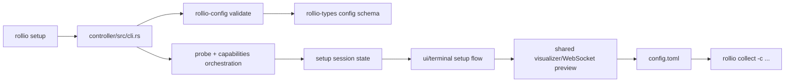

# Sprint 6 Setup Wizard

## Recommended Direction

- Build the first setup experience in the existing Ink terminal UI at [ui/terminal/src/index.tsx](ui/terminal/src/index.tsx) and [ui/terminal/src/App.tsx](ui/terminal/src/App.tsx); do not build a web setup wizard in Sprint 6.
- Keep `rollio-types` as the crate name for this sprint to avoid broad churn across current dependents, but add a config-facing binary target named `rollio-config` inside that crate. Revisit a crate rename only after the setup flow stabilizes.
- Split validation into two layers:
  - Static schema + cross-field validation lives in [rollio-types/src/config.rs](rollio-types/src/config.rs).
  - Hardware availability checks stay in the `rollio setup` / `rollio collect` orchestration path under [controller/src/cli.rs](controller/src/cli.rs) and [controller/src/collect.rs](controller/src/collect.rs).
- Treat [rollio-types/src/config.rs](rollio-types/src/config.rs) as the source of truth for emitted TOML, but make the schema machine-readable so future UIs do not need to duplicate the config shape by hand.

## Why This Fits The Repo

- Sprint 6 is already defined as `rollio setup` with discovery, parameter editing, pairing, preview, and save in [design/implementation-plan.md](design/implementation-plan.md).
- The terminal UI already has setup affordances in [ui/terminal/src/components/TitleBar.tsx](ui/terminal/src/components/TitleBar.tsx), including `wizardStep`, plus responsive full-screen layout patterns in [ui/terminal/src/App.tsx](ui/terminal/src/App.tsx).
- The current config model is strong but monolithic: [rollio-types/src/config.rs](rollio-types/src/config.rs) already parses TOML, runs deep validation, derives runtime configs, and preserves driver-specific fields via `DeviceConfig.extra`.
- The current `rollio` CLI only supports `collect` in [controller/src/lib.rs](controller/src/lib.rs) and [controller/src/cli.rs](controller/src/cli.rs), so Sprint 6 needs a new orchestration path rather than just UI work.

## Proposed Architecture

## Workstreams

### 1. Config schema and validator foundation

- Refactor [rollio-types/src/config.rs](rollio-types/src/config.rs) into a clearer schema boundary, even if the first pass stays in one crate. The goal is to separate:
  - public config data model,
  - machine-readable schema export,
  - imperative cross-field validation,
  - runtime-config derivation helpers.
- Add a `rollio-config` binary target under [rollio-types/Cargo.toml](rollio-types/Cargo.toml) with at least:
  - `rollio-config validate --config <path>` for TOML parse + static validation,
  - `rollio-config schema` to emit a machine-readable schema for future UI consumers.
- Make the schema cover structural rules, enums, defaults, and documented sections from [config/config.example.toml](config/config.example.toml). Keep hardware reachability out of this binary.
- Preserve extensibility for driver-specific settings by keeping the existing `DeviceConfig.extra` behavior instead of hard-coding every future driver field into the wizard.
- Expand [rollio-types/tests/config.rs](rollio-types/tests/config.rs) and [rollio-types/tests/config_d435i_v4l2_airbot_play_eef_sprint5.rs](rollio-types/tests/config_d435i_v4l2_airbot_play_eef_sprint5.rs) to cover schema export, validator CLI behavior, and error messages.

### 2. Controller-side setup orchestration

- Extend [controller/src/lib.rs](controller/src/lib.rs) and [controller/src/cli.rs](controller/src/cli.rs) with a `setup` command and shared helpers for loading or resuming config.
- Introduce a setup-session backend in `controller` that owns:
  - driver discovery by executable naming convention,
  - `probe` and `capabilities` fan-out,
  - aggregated discovered-device state,
  - selected device and pairing state,
  - save/load of final TOML.
- Add a resume path for `rollio setup -c config.toml` that:
  - runs `rollio-config validate` semantics first,
  - performs hardware availability checks afterwards,
  - jumps directly to preview/edit state when the config is valid.
- Reuse as much of the existing runtime-config derivation in [controller/src/collect.rs](controller/src/collect.rs) and [rollio-types/src/config.rs](rollio-types/src/config.rs) as possible so preview/runtime behavior stays aligned with collection.
- Keep web-serving concerns in [ui-server/src/main.rs](ui-server/src/main.rs) out of Sprint 6 setup; setup should not depend on a browser bundle.

### 3. TUI wizard in `ui/terminal`

- Add a dedicated setup entrypoint or mode in [ui/terminal/src/index.tsx](ui/terminal/src/index.tsx) so setup does not boot the collect-only path by default.
- Reuse [ui/terminal/src/components/TitleBar.tsx](ui/terminal/src/components/TitleBar.tsx) and the responsive layout primitives in [ui/terminal/src/App.tsx](ui/terminal/src/App.tsx) for a step-based wizard shell.
- Extend the terminal protocol in [ui/terminal/src/lib/protocol.ts](ui/terminal/src/lib/protocol.ts) and the Rust side in [visualizer/src/protocol.rs](visualizer/src/protocol.rs) so the terminal client can receive discovery/capability data and send step edits, preview requests, and save intents.
- Build the wizard in this order so each slice is independently testable:
  - discovery and selection,
  - per-device parameters,
  - pairing,
  - storage and episode format,
  - preview and confirm/save.
- Use the existing WebSocket and preview rendering pipeline in [ui/terminal/src/lib/websocket.ts](ui/terminal/src/lib/websocket.ts) for the preview step instead of building a second live-preview path.
- Keep the first implementation terminal-only. A future web wizard can consume the same schema and setup-session protocol later.

### 4. Preview, round-trip, and acceptance criteria

- The saved config must round-trip through [rollio-types/src/config.rs](rollio-types/src/config.rs) and launch successfully with `rollio collect -c ...`.
- Preview should reuse the same device runtime assumptions as collection, but Sprint 6 does not need to replace the current browser collect UI.
- The Sprint 6 checkpoint should be re-scoped as:
  - `rollio setup` in terminal discovers pseudo devices,
  - user can complete a full wizard and save TOML,
  - `rollio collect -c saved.toml` accepts that config,
  - `rollio setup -c saved.toml` resumes at preview/edit instead of starting discovery again.

## Test Strategy

- Rust unit/integration tests:
  - schema export snapshot or golden-file test,
  - validator binary success/failure cases,
  - probe/capabilities orchestration with mocked drivers,
  - config resume path with syntax, semantic, and missing-device failures.
- Terminal UI tests in [ui/terminal/test](ui/terminal/test):
  - step reducer/state-transition tests,
  - render tests for title/status bars and step pages,
  - a scripted happy path using pseudo devices.
- End-to-end smoke checks:
  - run `rollio setup` against pseudo devices,
  - save TOML,
  - validate via `rollio-config validate`,
  - run `rollio collect -c saved.toml`.

## Explicit Deferrals

- No browser-based setup wizard in Sprint 6.
- No full crate rename away from `rollio-types` during the first wizard implementation. If a rename becomes worthwhile, do it later behind a compatibility facade rather than mixing it into the setup sprint.
- No attempt to push hardware reachability checks into `rollio-types`; that belongs in controller orchestration, not the static schema layer.
