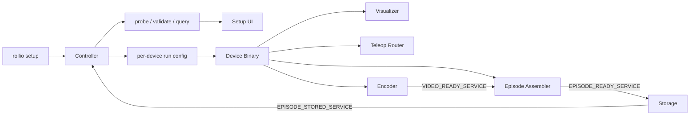

# Sprint Extra A - Whole Pipeline Device-Binary Migration

## Recommended Direction

- Move device-family knowledge out of the framework and into executables that implement `probe`, `validate`, `query`, `run`, and `run --dry-run`.
- Perform this migration for all currently supported cameras and robots so every supported device family implements the new contract.
- Keep the non-device control plane unchanged in the first migration phase:
  - `control/events`
  - `control/episode-command`
  - `control/episode-status`
  - `setup/command`
  - `setup/state`
  - `encoder/video-ready`
  - `encoder/backpressure`
  - `assembler/episode-ready`
  - `storage/episode-stored`
- Use hierarchical topics only for device data.
- Treat `channel_type` as a fixed vocabulary item defined by each driver family, not as a user-defined runtime name. Examples: `arm`, `g2`, `e2`, `color`, `depth`, `infrared`.
- Keep discovery hybrid: explicit registration is supported, and PATH-based discovery can also be supported.
- Implement the `pseudo` device first as the reference migration path, then migrate the currently supported real device families onto the same contract.

## Why This Migration Is Needed

- Setup discovery is still framework-owned in [controller/src/setup.rs](controller/src/setup.rs) via `known_drivers()`, mounted AIRBOT end-effector channel synthesis, and several AIRBOT- and V4L2-specific heuristics.
- Executable resolution is still hardcoded around `rollio-camera-*` and `rollio-robot-*` in [controller/src/runtime_paths.rs](controller/src/runtime_paths.rs) and [rollio-types/src/config.rs](rollio-types/src/config.rs).
- The current config and runtime derivation assume one flat logical camera or robot per row in [rollio-types/src/config.rs](rollio-types/src/config.rs), especially `camera_names()`, `robot_names()`, `encoder_runtime_configs()`, and `assembler_runtime_config()`.
- The current data plane is shared and hardcoded across [rollio-bus/src/lib.rs](rollio-bus/src/lib.rs), [controller/src/collect.rs](controller/src/collect.rs), [visualizer/src/ipc.rs](visualizer/src/ipc.rs), [teleop-router/src/lib.rs](teleop-router/src/lib.rs), [encoder/src/runtime.rs](encoder/src/runtime.rs), and [episode-assembler/src/runtime.rs](episode-assembler/src/runtime.rs).

## Proposed Architecture



## Shared Contract Recommendations

### 1. `query --json`

- `query` should be authoritative for setup, preview, pairing, and generated config.
- It should replace controller-owned heuristics for:
  - channel availability
  - supported modes
  - supported state topics
  - supported command topics
  - FK and IK support
  - direct-joint compatibility
  - default command parameters such as `kp` and `kd`

#### Recommended shape

```json
{
  "driver": "airbot-play",
  "devices": [
    {
      "id": "PZ60C02603000894",
      "device_class": "airbot-play",
      "device_label": "AIRBOT Play",
      "optional_info": {},
      "channels": [
        {
          "channel_type": "arm",
          "kind": "robot",
          "available": true,
          "modes": ["free-drive", "command-following", "disabled"],
          "supported_states": ["joint_position", "joint_velocity", "joint_effort", "end_effector_pose"],
          "supported_commands": ["joint_position", "joint_mit", "end_pose"],
          "supports_fk": true,
          "supports_ik": true,
          "dof": 6,
          "default_control_frequency_hz": 250.0,
          "direct_joint_compatibility": {
            "can_lead": [
              { "driver": "airbot-play", "channel_type": "arm" }
            ],
            "can_follow": [
              { "driver": "airbot-play", "channel_type": "arm" }
            ]
          },
          "defaults": {
            "joint_mit_kp": [40.0, 40.0, 40.0, 25.0, 25.0, 10.0],
            "joint_mit_kd": [1.2, 1.2, 1.2, 0.8, 0.8, 0.3]
          },
          "optional_info": {}
        },
        {
          "channel_type": "e2",
          "kind": "robot",
          "available": true,
          "modes": ["free-drive", "command-following", "disabled"],
          "supported_states": ["parallel_position"],
          "supported_commands": ["parallel_position", "parallel_mit"],
          "supports_fk": false,
          "supports_ik": false,
          "dof": 1,
          "default_control_frequency_hz": 250.0,
          "direct_joint_compatibility": {
            "can_lead": [],
            "can_follow": []
          },
          "defaults": {},
          "optional_info": {}
        },
        {
          "channel_type": "color",
          "kind": "camera",
          "available": true,
          "profiles": [
            { "width": 1280, "height": 720, "fps": 30, "pixel_format": "rgb24" }
          ],
          "optional_info": {}
        }
      ]
    }
  ]
}
```

### 2. Per-device `run` config

- `run` receives a single device configuration, not the whole project config.
- The controller's master config should store one such device block per physical device and pass the selected block to the device binary.
- `run --dry-run` validates the same schema without starting the runtime.

#### Recommended shape

```toml
name = "airbot_left"
driver = "airbot-play"
id = "PZ60C02603000894"
bus_root = "airbot_left"

[extra]
transport = "can"
interface = "can0"

[[channels]]
channel_type = "arm"
kind = "robot"
enabled = true
mode = "free-drive"
publish_states = ["joint_position", "joint_velocity", "joint_effort", "end_effector_pose"]
control_frequency_hz = 250.0

[channels.command_defaults]
joint_mit_kp = [40.0, 40.0, 40.0, 25.0, 25.0, 10.0]
joint_mit_kd = [1.2, 1.2, 1.2, 0.8, 0.8, 0.3]

[[channels]]
channel_type = "e2"
kind = "robot"
enabled = true
mode = "command-following"
publish_states = ["parallel_position"]

[[channels]]
channel_type = "color"
kind = "camera"
enabled = true
profile = { width = 1280, height = 720, fps = 30, pixel_format = "rgb24" }
```

### 3. Device-data topic and payload contract

- Hierarchical topic naming should be used only for device data.
- The runtime topic namespace should be rooted at `bus_root`.
- Replace untyped variable-length arrays with bounded payload families.
- Use millisecond timestamps in device-data payloads.
- Constants:
  - `MAX_DOF = 15`
  - `MAX_PARALLEL = 2`

#### Recommended topic surface

```text
{bus_root}/info
{bus_root}/shutdown
{bus_root}/{channel_type}/status
{bus_root}/{channel_type}/info/mode
{bus_root}/{channel_type}/control/mode
{bus_root}/{channel_type}/info/profile
{bus_root}/{channel_type}/control/profile
{bus_root}/{channel_type}/frames
{bus_root}/{channel_type}/states/joint_position
{bus_root}/{channel_type}/states/joint_velocity
{bus_root}/{channel_type}/states/joint_effort
{bus_root}/{channel_type}/states/end_effector_pose
{bus_root}/{channel_type}/states/end_effector_twist
{bus_root}/{channel_type}/states/end_effector_wrench
{bus_root}/{channel_type}/states/parallel_position
{bus_root}/{channel_type}/states/parallel_velocity
{bus_root}/{channel_type}/states/parallel_effort
{bus_root}/{channel_type}/commands/joint_position
{bus_root}/{channel_type}/commands/joint_mit
{bus_root}/{channel_type}/commands/end_pose
{bus_root}/{channel_type}/commands/parallel_position
{bus_root}/{channel_type}/commands/parallel_mit
```

#### Recommended payload families

```text
Camera frames:
CameraFrameHeader { timestamp_us, ... } + [u8]

Joint vectors:
JointVector15 { timestamp_us, len, values[15] }

Parallel vectors:
ParallelVector2 { timestamp_us, len, values[2] }

Pose:
Pose7 { timestamp_us, xyz_xyzw[7] }

Joint MIT command:
JointMitCommand15 { timestamp_us, len, position[15], velocity[15], effort[15], kp[15], kd[15] }

Parallel MIT command:
ParallelMitCommand2 { timestamp_us, len, position[2], velocity[2], effort[2], kp[2], kd[2] }
```

### 4. Framework-side pairing config

- Pairing remains framework-owned, not device-owned.
- Setup should derive legal pairings from `query.direct_joint_compatibility`, `supported_states`, `supported_commands`, and FK or IK support.

#### Recommended shape

```toml
[[pairings]]
leader_device = "airbot_master"
leader_channel_type = "arm"
follower_device = "airbot_left"
follower_channel_type = "arm"
mapping = "direct-joint"
leader_state = "joint_position"
follower_command = "joint_mit"
```

## Migration Workstreams

### 1. Freeze the current compatibility surface

- Audit [controller/src/setup.rs](controller/src/setup.rs), [controller/src/runtime_paths.rs](controller/src/runtime_paths.rs), [rollio-types/src/config.rs](rollio-types/src/config.rs), [rollio-bus/src/lib.rs](rollio-bus/src/lib.rs), [controller/src/collect.rs](controller/src/collect.rs), [visualizer/src/ipc.rs](visualizer/src/ipc.rs), [teleop-router/src/lib.rs](teleop-router/src/lib.rs), [encoder/src/runtime.rs](encoder/src/runtime.rs), and [episode-assembler/src/runtime.rs](episode-assembler/src/runtime.rs).
- Classify each static assumption as setup-only, data-plane, or preserved control-plane.

### 2. Define shared schemas in `rollio-types`

- Add channel-aware config types, `query` JSON types, and typed runtime payload types in [rollio-types/src/config.rs](rollio-types/src/config.rs), [rollio-types/src/messages.rs](rollio-types/src/messages.rs), and [rollio-types/src/schema.rs](rollio-types/src/schema.rs).
- Replace the current ad hoc channel and driver heuristics with explicit schema fields.
- Remove placeholders such as “somehow variable-length array of doubles.”

### 3. Refactor setup to be driver-authored

- Replace `known_drivers()` and `capabilities` flow in [controller/src/setup.rs](controller/src/setup.rs) with hybrid discovery plus `query`.
- Remove synthetic AIRBOT derived devices from controller discovery.
- Use `run --dry-run` for validation of per-device runtime configs.
- Update setup UI transport in [ui/terminal/src/lib/protocol.ts](ui/terminal/src/lib/protocol.ts) to represent physical devices with nested channel selections.

### 4. Migrate data-plane naming and spawning

- Change [controller/src/collect.rs](controller/src/collect.rs) from flat camera or robot rows to one device process exposing multiple channel topics under `bus_root`.
- Replace flat helpers in [rollio-bus/src/lib.rs](rollio-bus/src/lib.rs) and [rollio-types/src/config.rs](rollio-types/src/config.rs) with channel-aware topic derivation.
- Preserve the non-device control plane in the first pass.

### 5. Update downstream consumers

- Visualizer: subscribe to hierarchical channel topics and expose channel-aware state in [visualizer/src/ipc.rs](visualizer/src/ipc.rs) and [visualizer/src/protocol.rs](visualizer/src/protocol.rs).
- Teleop Router: consume pairing config plus `query.direct_joint_compatibility` instead of hardcoded AIRBOT rules in [teleop-router/src/lib.rs](teleop-router/src/lib.rs).
- Encoder: spawn one encoder per enabled camera channel and keep correlation with assembler explicit in [encoder/src/runtime.rs](encoder/src/runtime.rs).
- Episode Assembler: subscribe only to selected recorded states and actions in [episode-assembler/src/runtime.rs](episode-assembler/src/runtime.rs) and [episode-assembler/src/dataset.rs](episode-assembler/src/dataset.rs).
- Storage: keep the episode-level control plane unchanged unless a later migration makes a strong case for changing it.

### 6. Remove legacy hardcoding and backfill tests

- Delete `DirectJointMappingKind`, setup-specific AIRBOT derivation, and other framework-owned device-family rules once `query` carries the necessary metadata.
- Rewrite tests and fixtures that assume flat `camera/<name>` and `robot/<name>` topics.
- Add end-to-end coverage for:
  - one multi-channel camera device
  - one multi-channel robot device
  - one direct-joint compatible pair derived only from `query`
  - one dry-run validation path for device configs
